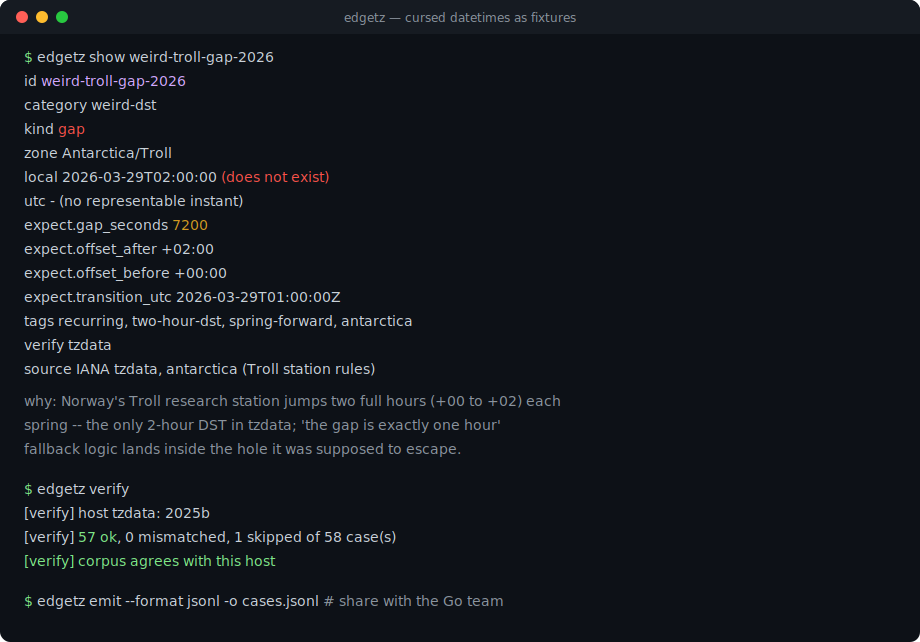
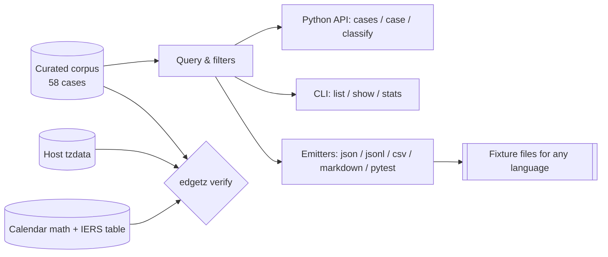

# edgetz

[English](README.md) | [中文](README.zh.md) | [日本語](README.ja.md)

[](LICENSE) [](CHANGELOG.md) [](pyproject.toml)  [](CONTRIBUTING.md)

**「最凶の実在日時」を集めたオープンソースのコーパス——DST の空白、二重に存在する時刻、消えた日付、うるう日、第 53 週——を、機械検証済みのテストフィクスチャとしてそのまま提供。**



```bash
git clone https://github.com/JaydenCJ/edgetz && cd edgetz && pip install -e .
```

> **プレリリース：** edgetz はまだ PyPI に公開されていません。初回リリースまでは [JaydenCJ/edgetz](https://github.com/JaydenCJ/edgetz) をクローンし、リポジトリのルートで `pip install -e .` を実行してください。

## なぜ edgetz？

どのバックエンドチームも年に二回はタイムゾーンの境界条件に噛まれ、自分を噛んだ一件だけを書き留めて残りを忘れます。実際に本番を壊すケースは tzdata の変更履歴、IERS の公報、障害報告書に散らばっています：サモアが消した日付、リベリアの -00:44:30 オフセット、南極の 2 時間 DST ジャンプ、ISO 週が 53 個ある年。edgetz はその組織的記憶をパッケージにしたものです：出典付きで整理された 58 件の実在ケースに、機械検証可能な正解データ（正確な UTC 時刻、秒精度のオフセット、遷移時刻）、クエリ API と CLI、そして同じコーパスであらゆる言語のテストを駆動できるエミッタが付属します。これは意図的に、もう一つの日時ライブラリ**ではありません**——*あなたの*日時コードを壊すデータを提供し、さらに `verify` コマンドがそのデータ自体をホストの tzdata で証明します。

|  | edgetz | 手書きフィクスチャ | Hypothesis | freezegun / time-machine |
|---|---|---|---|---|
| 出典付きの実在ケースを厳選収録 | 58 件、出典と日付つき | 過去の障害が教えてくれた分だけ | ランダムで合成的 | なし（時計を止めるだけ） |
| 正解データ内蔵（UTC 時刻、オフセット、空白幅） | あり、機械検証済み | 自分の仕事 | なし——オラクルは自前で用意 | 該当せず |
| 1 時間未満・複数日にわたる遷移を網羅 | 30 分、44.5 分、2 時間、丸一日の消失 | まれ | 戦略が知っている場合のみ | なし |
| 多言語向けエクスポート | JSON / JSONL / CSV / Markdown / pytest | 手作業 | なし | なし |
| ホスト tzdata の監査 | `edgetz verify` | なし | なし | なし |
| ランタイム依存 | 0 | 該当せず | 3 | 1 |

<sub>依存数は 2026-07 時点で PyPI に宣言されたランタイム要件です：hypothesis 6.x（3：attrs、sortedcontainers、exceptiongroup）、freezegun 1.5 と time-machine 2.x（各 1：python-dateutil）。edgetz の数は [pyproject.toml](pyproject.toml) の `dependencies = []` です。</sub>

## 特徴

- **10 カテゴリ・58 件の病的日時を厳選**——DST の空白と折り返し、真夜中のない日付、存在しなかった日付、秒精度オフセット、負の DST、うるう日、第 53 週、うるう秒、そしてエポックの崖（2038、GPS、NTP）。
- **正解データ内蔵**——各ケースに正確な UTC 時刻、遷移前後のオフセット、遷移時刻、空白/折り返し幅が付属し、アサーションが推測ではなくオラクルを持てます。
- **フレームワークではなくフィクスチャ**——ケースは frozen な dataclass で、素の辞書に変換可能；pytest を直接パラメトライズしても、JSON/JSONL/CSV を Go・Java・TypeScript のスイートに渡してもよい。
- **`edgetz verify` が環境を監査**——コーパス全体をホストの tzdata と純粋な暦計算で再計算；古い CI イメージや政府によるルール変更は非ゼロ終了コードとして現れます。
- **IERS うるう秒表を完全収録**——全 27 回の挿入と TAI-UTC オフセットを、そのままデータとして import 可能。
- **ランタイム依存ゼロ、完全オフライン**——標準ライブラリのみ；何も取得せず、何も送信しません。

## クイックスタート

インストール：

```bash
git clone https://github.com/JaydenCJ/edgetz && cd edgetz && pip install -e .
```

以下を `quickstart.py` として保存：

```python
import edgetz

# Every wall-clock time that will not exist next spring:
for case in edgetz.cases(category="dst-gap", tag="recurring"):
    print(f"{case.local} never happens in {case.zone}")

# ...and one that happens twice:
fold = edgetz.case("fold-havana-double-midnight-2026")
print(f"{fold.local} in {fold.zone} maps to {fold.utc[0]} AND {fold.utc[1]}")
```

実行結果（実際の実行からの転載）：

```text
2026-03-08T02:30:00 never happens in America/New_York
2026-03-29T01:30:00 never happens in Europe/London
2026-03-29T02:30:00 never happens in Europe/Berlin
2026-10-04T02:30:00 never happens in Australia/Sydney
2026-03-22T02:30:00 never happens in Africa/Casablanca
2026-11-01T00:00:00 in America/Havana maps to 2026-11-01T04:00:00Z AND 2026-11-01T05:00:00Z
```

`parametrize` 一つでコーパスを自分のコードに向けられます：

```python
import edgetz, pytest

@pytest.mark.parametrize("case", edgetz.cases(kind="gap"), ids=lambda c: c.id)
def test_scheduler_survives_nonexistent_times(case):
    run_at = my_scheduler.next_run(case.local_datetime(), case.zone)
    assert edgetz.classify(run_at, case.zone) == "unique"
```

Python 以外のチームにはエクスポートを：

```bash
edgetz emit --format jsonl -o cases.jsonl   # one case per line, ready to commit
```

## コーパス

| カテゴリ | 件数 | 何に噛まれるか |
|---|---|---|
| `dst-gap` | 6 | 存在しない壁時計時刻（春の時計進めによる空白） |
| `dst-fold` | 7 | 二度存在する壁時計時刻。ハバナの二重真夜中を含む |
| `missing-midnight` | 4 | DST が真夜中に始まるため 00:00 が存在しない日付 |
| `skipped-date` | 3 | 丸ごと存在しなかった日付（サモア 2011、クェゼリン 1993、キリバス 1994） |
| `offset-shift` | 7 | 恒久的なオフセット変更：-00:44:30、+05:45、+14、政治的な 30 分移動 |
| `weird-dst` | 7 | 30 分 DST、2 時間 DST、負の DST、二重サマータイム |
| `leap-day` | 6 | 2 月 29 日の算術、1900/2100 の世紀の罠、スウェーデンの 2 月 30 日 |
| `week-53` | 5 | ISO 週が 53 ある年と、週年 vs 暦年のフォーマットバグ |
| `leap-second` | 4 | 実システムが実際に配信し、大半のパーサが拒む 23:59:60Z リテラル |
| `epoch-boundary` | 9 | Y2K38 とその回り込み、GPS/NTP ロールオーバー、番兵エポック、datetime.min/max |

各ケースには安定した id、引き起こすバグの種類を名指しする `why`、出典を記録する `source`、機械検証可能な正解データを収めた `expect` ブロックがあります。完全なスキーマは [`docs/corpus-format.md`](docs/corpus-format.md) に記載しています。

## CLI リファレンス

| コマンド | 効果 |
|---|---|
| `edgetz list [--category C] [--zone Z] [--tag T] [--kind K]` | 該当ケースの一覧表 |
| `edgetz show <id>` | ケース 1 件の全体像：正解データ、タグ、出典、理由 |
| `edgetz emit --format json\|jsonl\|csv\|markdown\|pytest [-o FILE]` | フィクスチャのエクスポート（フィルタ適用可） |
| `edgetz categories` / `edgetz zones` / `edgetz stats` | コーパスの語彙と件数 |
| `edgetz verify [--strict]` | ホスト tzdata + 暦計算でコーパスを再検証 |

終了コード：`0` 成功、`1` 検証不一致、`2` 使い方の誤りまたは未知の id（did-you-mean 候補つき）。フィルタの打ち間違いは黙って 0 件マッチせず例外になるため、フィクスチャ駆動のスイートが空回りで通ることはありません。

## 検証

このリポジトリは CI を同梱しません；上記の主張はすべてローカル実行で検証されています。このリポジトリのチェックアウトから再現できます：

```bash
pip install -e '.[dev]' && pytest && bash scripts/smoke.sh
```

出力（実際の実行からの転載、`...` で省略）：

```text
89 passed in 0.31s
...
[verify] 57 ok, 0 mismatched, 1 skipped of 58 case(s)
[verify] corpus agrees with this host
SMOKE OK
```

唯一スキップされる検査はスウェーデン 1712 年の 2 月 30 日——性質上 tzdata のモデル外にあるため、人手整理のみと正直に明記しています。

## アーキテクチャ



## ロードマップ

- [x] 10 カテゴリ 58 ケースのコーパス、クエリ API、5 種のエミッタ、tzdata + 暦の二重検証エンジン、CLI（v0.1.0）
- [ ] ゾーン追加：ガザ/ヘブロンの真夜中ルール、行ったり来たりのフィジー DST、エジプトの 2023 年 DST 復活
- [ ] PyPI への公開（`pip install edgetz`）
- [ ] 二つの tzdata バージョンを比較する `edgetz diff`（アップグレードの影響を事前確認）
- [ ] コーパスを種にした Hypothesis ストラテジ（厳選ケースを縮小ターゲットに）
- [ ] エクスポート形式の JSON Schema

完全な一覧は [open issues](https://github.com/JaydenCJ/edgetz/issues) を参照してください。

## コントリビュート

貢献歓迎です——出典付きの新しい「呪われた日時」こそ最初の PR に最適。まずは [good first issue](https://github.com/JaydenCJ/edgetz/issues?q=is%3Aissue+is%3Aopen+label%3A%22good+first+issue%22) から、または [discussion](https://github.com/JaydenCJ/edgetz/discussions) を立ててください。開発環境の構築は [CONTRIBUTING.md](CONTRIBUTING.md) を参照。

## ライセンス

[MIT](LICENSE)
