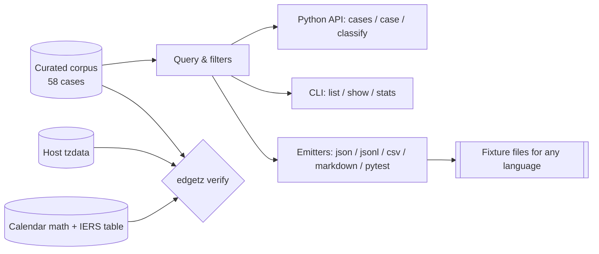

# edgetz

[English](README.md) | [中文](README.zh.md) | [日本語](README.ja.md)

[](LICENSE) [](CHANGELOG.md) [](pyproject.toml)  [](CONTRIBUTING.md)

**Open-source corpus of the nastiest real datetimes — DST gaps, ambiguous folds, skipped dates, leap days, week 53 — shipped as ready-made, machine-verified test fixtures.**


```bash
git clone https://github.com/JaydenCJ/edgetz && cd edgetz && pip install -e .
```

> **Pre-release:** edgetz is not yet published to PyPI. Until the first release, clone [JaydenCJ/edgetz](https://github.com/JaydenCJ/edgetz) and run `pip install -e .` from the repository root.

## Why edgetz?

Every backend team gets bitten by timezone edge cases twice a year, then writes down the one case that bit them and forgets the rest. The cases that actually break production are scattered across tzdata changelogs, IERS bulletins, and postmortems: the date Samoa deleted, Liberia's -00:44:30 offset, Antarctica's 2-hour DST jump, the year with 53 ISO weeks. edgetz is that institutional memory as a package: 58 curated, sourced, real cases with machine-checkable ground truth (exact UTC instants, offsets to the second, transition instants), a query API and CLI, and emitters so the same corpus drives tests in any language. It is deliberately **not** another datetime library — it ships data that breaks *your* datetime code, plus a `verify` command that proves the data against your host's tzdata.

|  | edgetz | Hand-rolled fixtures | Hypothesis | freezegun / time-machine |
|---|---|---|---|---|
| Curated real-world cases with provenance | 58, sourced and dated | Whatever past incidents taught you | Random, synthetic | None (they freeze the clock) |
| Ground truth included (UTC instants, offsets, gap widths) | Yes, machine-verified | Your job | No — you must supply the oracle | Not applicable |
| Covers sub-hour and multi-day transitions | 30 min, 44.5 min, 2 h, whole skipped dates | Rarely | Only if your strategy knows them | No |
| Cross-language export | JSON / JSONL / CSV / Markdown / pytest | Manual | No | No |
| Audits the host tzdata | `edgetz verify` | No | No | No |
| Runtime dependencies | 0 | n/a | 3 | 1 |

<sub>Dependency counts are declared runtime requirements on PyPI as of 2026-07: hypothesis 6.x (3: attrs, sortedcontainers, exceptiongroup), freezegun 1.5 and time-machine 2.x (1: python-dateutil each). edgetz's count is `dependencies = []` in [pyproject.toml](pyproject.toml).</sub>

## Features

- **58 curated pathological datetimes across 10 categories** — DST gaps and folds, dates with no midnight, dates that never existed, seconds-precision offsets, negative DST, leap days, week 53, leap seconds, and epoch cliffs (2038, GPS, NTP).
- **Ground truth included** — every case carries the exact UTC instants, offsets before/after, transition instant, and gap/fold width, so your assertions have an oracle instead of a guess.
- **Fixtures, not a framework** — cases are frozen dataclasses with plain-dict export; parametrize pytest directly or emit JSON/JSONL/CSV for Go, Java, and TypeScript suites.
- **`edgetz verify` audits your environment** — recomputes the whole corpus against the host tzdata and pure calendar math; a stale CI image or a government rule change shows up as a non-zero exit.
- **The full IERS leap-second table** — all 27 insertions with TAI-UTC offsets, importable as data.
- **Zero runtime dependencies, fully offline** — standard library only; nothing is fetched, nothing phones home.

## Quickstart

Install:

```bash
git clone https://github.com/JaydenCJ/edgetz && cd edgetz && pip install -e .
```

Save this as `quickstart.py`:

```python
import edgetz

# Every wall-clock time that will not exist next spring:
for case in edgetz.cases(category="dst-gap", tag="recurring"):
    print(f"{case.local} never happens in {case.zone}")

# ...and one that happens twice:
fold = edgetz.case("fold-havana-double-midnight-2026")
print(f"{fold.local} in {fold.zone} maps to {fold.utc[0]} AND {fold.utc[1]}")
```

Run it (output copied from a real run):

```text
2026-03-08T02:30:00 never happens in America/New_York
2026-03-29T01:30:00 never happens in Europe/London
2026-03-29T02:30:00 never happens in Europe/Berlin
2026-10-04T02:30:00 never happens in Australia/Sydney
2026-03-22T02:30:00 never happens in Africa/Casablanca
2026-11-01T00:00:00 in America/Havana maps to 2026-11-01T04:00:00Z AND 2026-11-01T05:00:00Z
```

Point the corpus at your own code with one `parametrize`:

```python
import edgetz, pytest

@pytest.mark.parametrize("case", edgetz.cases(kind="gap"), ids=lambda c: c.id)
def test_scheduler_survives_nonexistent_times(case):
    run_at = my_scheduler.next_run(case.local_datetime(), case.zone)
    assert edgetz.classify(run_at, case.zone) == "unique"
```

Or export it for a non-Python team:

```bash
edgetz emit --format jsonl -o cases.jsonl   # one case per line, ready to commit
```

## The corpus

| Category | Cases | What bites you |
|---|---|---|
| `dst-gap` | 6 | Wall-clock times that do not exist (spring-forward gaps) |
| `dst-fold` | 7 | Wall-clock times that exist twice, including Havana's double midnight |
| `missing-midnight` | 4 | Dates with no 00:00 because DST starts at midnight |
| `skipped-date` | 3 | Whole dates that never happened (Samoa 2011, Kwajalein 1993, Kiribati 1994) |
| `offset-shift` | 7 | Permanent offset changes: -00:44:30, +05:45, +14, political 30-minute moves |
| `weird-dst` | 7 | 30-minute DST, 2-hour DST, negative DST, double summer time |
| `leap-day` | 6 | Feb 29 arithmetic, the 1900/2100 century traps, Sweden's Feb 30 |
| `week-53` | 5 | 53-week ISO years and week-year vs calendar-year formatting bugs |
| `leap-second` | 4 | 23:59:60Z literals that real systems broadcast and most parsers reject |
| `epoch-boundary` | 9 | Y2K38 and its wraparound, GPS/NTP rollovers, sentinel epochs, datetime.min/max |

Every case has a stable id, a `why` naming the bug class it triggers, a `source` recording provenance, and an `expect` block with the machine-checkable ground truth. The full schema is documented in [`docs/corpus-format.md`](docs/corpus-format.md).

## CLI reference

| Command | Effect |
|---|---|
| `edgetz list [--category C] [--zone Z] [--tag T] [--kind K]` | Table of matching cases |
| `edgetz show <id>` | One case in full: ground truth, tags, provenance, why |
| `edgetz emit --format json\|jsonl\|csv\|markdown\|pytest [-o FILE]` | Export fixtures (filters apply) |
| `edgetz categories` / `edgetz zones` / `edgetz stats` | Corpus vocabulary and counts |
| `edgetz verify [--strict]` | Re-check the corpus against host tzdata + calendar math |

Exit codes: `0` success, `1` verification mismatch, `2` usage error or unknown id (with did-you-mean suggestions). A filter typo raises instead of silently matching nothing, so a fixture-driven suite can never pass vacuously.

## Verification

This repository ships no CI; every claim above is verified by local runs. Reproduce them from a checkout of this repository:

```bash
pip install -e '.[dev]' && pytest && bash scripts/smoke.sh
```

Output (copied from a real run, truncated with `...`):

```text
89 passed in 0.31s
...
[verify] 57 ok, 0 mismatched, 1 skipped of 58 case(s)
[verify] corpus agrees with this host
SMOKE OK
```

The one skipped check is Sweden's 1712 February 30 — outside tzdata's model by nature, so it is curated-only and marked as such.

## Architecture



## Roadmap

- [x] 58-case corpus across 10 categories, query API, five emitters, tzdata + calendar verification engine, CLI (v0.1.0)
- [ ] More zones: Gaza/Hebron midnight rules, Fiji's on-again-off-again DST, Egypt's 2023 return to DST
- [ ] PyPI release with `pip install edgetz`
- [ ] `edgetz diff` between two tzdata versions, to preview what an upgrade changes
- [ ] Hypothesis strategies seeded by the corpus (curated cases as the shrink targets)
- [ ] JSON Schema for the emitted fixture format

See the [open issues](https://github.com/JaydenCJ/edgetz/issues) for the full list.

## Contributing

Contributions are welcome — a new cursed datetime with a source is the perfect first PR. Start with a [good first issue](https://github.com/JaydenCJ/edgetz/issues?q=is%3Aissue+is%3Aopen+label%3A%22good+first+issue%22) or open a [discussion](https://github.com/JaydenCJ/edgetz/discussions). See [CONTRIBUTING.md](CONTRIBUTING.md) for the development setup.

## License

[MIT](LICENSE)
