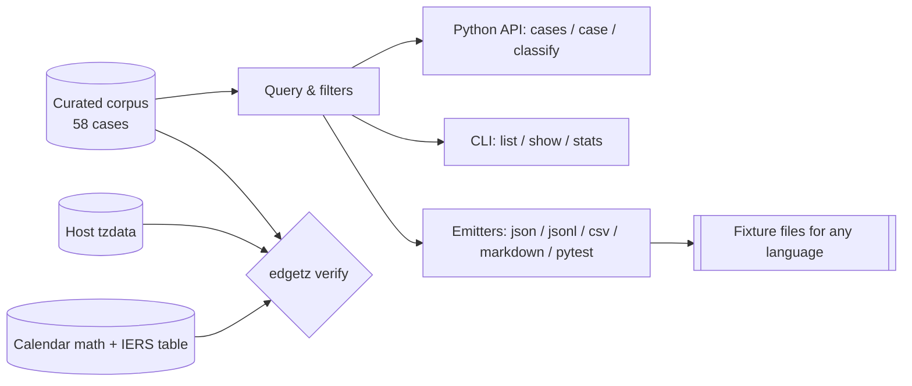

# edgetz

[English](README.md) | [中文](README.zh.md) | [日本語](README.ja.md)

[](LICENSE) [](CHANGELOG.md) [](pyproject.toml)  [](CONTRIBUTING.md)

**开源的"最阴险真实日期时间"语料库——DST 空洞、二义性折叠、被跳过的日期、闰日、第 53 周——以开箱即用、机器验证过的测试夹具形式交付。**


```bash
git clone https://github.com/JaydenCJ/edgetz && cd edgetz && pip install -e .
```

> **预发布：** edgetz 尚未发布到 PyPI。在首个正式版本之前，请克隆 [JaydenCJ/edgetz](https://github.com/JaydenCJ/edgetz) 并在仓库根目录运行 `pip install -e .`。

## 为什么选 edgetz？

每个后端团队每年都会被时区边界情况咬两次，然后只记下咬到自己的那一个案例，忘掉其余全部。真正会击穿生产环境的案例散落在 tzdata 变更日志、IERS 公报和事故复盘里：萨摩亚删掉的那一天、利比里亚的 -00:44:30 偏移、南极洲 2 小时的 DST 跳变、拥有 53 个 ISO 周的年份。edgetz 把这份组织记忆做成了一个包：58 个经过整理、注明出处的真实案例，附带机器可校验的基准真值（精确的 UTC 时刻、精确到秒的偏移、转换时刻），配套查询 API 与 CLI，还有导出器让同一份语料驱动任何语言的测试。它刻意**不是**又一个日期时间库——它交付的是能弄坏*你的*日期时间代码的数据，外加一条 `verify` 命令，用你主机上的 tzdata 证明这些数据本身。

|  | edgetz | 手写夹具 | Hypothesis | freezegun / time-machine |
|---|---|---|---|---|
| 有出处的真实世界精选案例 | 58 个，注明来源与日期 | 只有历史事故教过你的那些 | 随机、合成 | 无（它们只冻结时钟） |
| 内置基准真值（UTC 时刻、偏移、空洞宽度） | 有，机器验证过 | 你自己的活 | 无——预言机得你自己提供 | 不适用 |
| 覆盖小时以下与跨天的转换 | 30 分、44.5 分、2 小时、整天被跳过 | 很少 | 除非你的策略恰好知道它们 | 无 |
| 跨语言导出 | JSON / JSONL / CSV / Markdown / pytest | 手工 | 无 | 无 |
| 审计主机 tzdata | `edgetz verify` | 无 | 无 | 无 |
| 运行时依赖 | 0 | 不适用 | 3 | 1 |

<sub>依赖数量为 2026-07 时 PyPI 上声明的运行时依赖：hypothesis 6.x（3：attrs、sortedcontainers、exceptiongroup），freezegun 1.5 与 time-machine 2.x（各 1：python-dateutil）。edgetz 的数量即 [pyproject.toml](pyproject.toml) 中的 `dependencies = []`。</sub>

## 特性

- **10 大类、58 个精选的病态日期时间**——DST 空洞与折叠、没有午夜的日期、从未存在过的日期、秒级精度偏移、负 DST、闰日、第 53 周、闰秒，以及纪元悬崖（2038、GPS、NTP）。
- **内置基准真值**——每个案例都带有精确的 UTC 时刻、转换前后偏移、转换时刻及空洞/折叠宽度，你的断言有真正的预言机而不是猜测。
- **是夹具，不是框架**——案例是冻结的 dataclass，可导出为普通字典；既能直接参数化 pytest，也能输出 JSON/JSONL/CSV 供 Go、Java、TypeScript 测试套件使用。
- **`edgetz verify` 审计你的环境**——用主机 tzdata 与纯日历算术重算整个语料库；过期的 CI 镜像或某国政府改了规则，都会表现为非零退出码。
- **完整的 IERS 闰秒表**——全部 27 次插入及对应 TAI-UTC 偏移，可直接作为数据导入。
- **零运行时依赖、完全离线**——只用标准库；不下载任何东西，也不上报任何东西。

## 快速上手

安装：

```bash
git clone https://github.com/JaydenCJ/edgetz && cd edgetz && pip install -e .
```

将下面内容存为 `quickstart.py`：

```python
import edgetz

# Every wall-clock time that will not exist next spring:
for case in edgetz.cases(category="dst-gap", tag="recurring"):
    print(f"{case.local} never happens in {case.zone}")

# ...and one that happens twice:
fold = edgetz.case("fold-havana-double-midnight-2026")
print(f"{fold.local} in {fold.zone} maps to {fold.utc[0]} AND {fold.utc[1]}")
```

运行它（输出摘自一次真实运行）：

```text
2026-03-08T02:30:00 never happens in America/New_York
2026-03-29T01:30:00 never happens in Europe/London
2026-03-29T02:30:00 never happens in Europe/Berlin
2026-10-04T02:30:00 never happens in Australia/Sydney
2026-03-22T02:30:00 never happens in Africa/Casablanca
2026-11-01T00:00:00 in America/Havana maps to 2026-11-01T04:00:00Z AND 2026-11-01T05:00:00Z
```

用一个 `parametrize` 就能把语料库对准你自己的代码：

```python
import edgetz, pytest

@pytest.mark.parametrize("case", edgetz.cases(kind="gap"), ids=lambda c: c.id)
def test_scheduler_survives_nonexistent_times(case):
    run_at = my_scheduler.next_run(case.local_datetime(), case.zone)
    assert edgetz.classify(run_at, case.zone) == "unique"
```

或者导出给非 Python 团队：

```bash
edgetz emit --format jsonl -o cases.jsonl   # one case per line, ready to commit
```

## 语料库

| 类别 | 案例数 | 会咬你的地方 |
|---|---|---|
| `dst-gap` | 6 | 不存在的挂钟时间（春季拨快形成的空洞） |
| `dst-fold` | 7 | 出现两次的挂钟时间，包括哈瓦那的双重午夜 |
| `missing-midnight` | 4 | 因 DST 在午夜开始而没有 00:00 的日期 |
| `skipped-date` | 3 | 从未发生过的整天（萨摩亚 2011、夸贾林 1993、基里巴斯 1994） |
| `offset-shift` | 7 | 永久性偏移变更：-00:44:30、+05:45、+14、政治性的 30 分钟移动 |
| `weird-dst` | 7 | 30 分钟 DST、2 小时 DST、负 DST、双重夏令时 |
| `leap-day` | 6 | 2 月 29 日算术、1900/2100 世纪陷阱、瑞典的 2 月 30 日 |
| `week-53` | 5 | 53 周的 ISO 年份，以及周年份与日历年份的格式化错误 |
| `leap-second` | 4 | 真实系统广播过、多数解析器却拒绝的 23:59:60Z 字面量 |
| `epoch-boundary` | 9 | Y2K38 及其回绕、GPS/NTP 翻转、哨兵纪元、datetime.min/max |

每个案例都有稳定的 id、点名其触发的 bug 类别的 `why`、记录出处的 `source`，以及包含机器可校验基准真值的 `expect` 块。完整模式记录在 [`docs/corpus-format.md`](docs/corpus-format.md)。

## CLI 参考

| 命令 | 效果 |
|---|---|
| `edgetz list [--category C] [--zone Z] [--tag T] [--kind K]` | 匹配案例的表格 |
| `edgetz show <id>` | 单个案例全貌：基准真值、标签、出处、原因 |
| `edgetz emit --format json\|jsonl\|csv\|markdown\|pytest [-o FILE]` | 导出夹具（过滤器同样生效） |
| `edgetz categories` / `edgetz zones` / `edgetz stats` | 语料库词汇表与计数 |
| `edgetz verify [--strict]` | 用主机 tzdata + 日历算术重新校验语料库 |

退出码：`0` 成功，`1` 校验不一致，`2` 用法错误或未知 id（附 did-you-mean 建议）。过滤器打错字会直接报错而不是静默匹配零条，因此夹具驱动的测试套件永远不会空转通过。

## 验证

本仓库不附带任何 CI；上述所有声明都由本地运行验证。从本仓库的检出中即可复现：

```bash
pip install -e '.[dev]' && pytest && bash scripts/smoke.sh
```

输出（摘自一次真实运行，用 `...` 截断）：

```text
89 passed in 0.31s
...
[verify] 57 ok, 0 mismatched, 1 skipped of 58 case(s)
[verify] corpus agrees with this host
SMOKE OK
```

唯一被跳过的检查是瑞典 1712 年的 2 月 30 日——天然处于 tzdata 模型之外，因此仅作人工整理并如实标注。

## 架构



## 路线图

- [x] 覆盖 10 大类的 58 案例语料库、查询 API、五种导出器、tzdata + 日历双验证引擎、CLI（v0.1.0）
- [ ] 更多时区：加沙/希伯伦的午夜规则、斐济反复横跳的 DST、埃及 2023 年重启 DST
- [ ] 发布到 PyPI，支持 `pip install edgetz`
- [ ] `edgetz diff` 对比两个 tzdata 版本，预览升级会改变什么
- [ ] 以语料库为种子的 Hypothesis 策略（精选案例作为收缩目标）
- [ ] 为导出的夹具格式提供 JSON Schema

完整列表见 [open issues](https://github.com/JaydenCJ/edgetz/issues)。

## 贡献

欢迎贡献——一条带出处的新"受诅咒日期时间"就是完美的第一个 PR。可从 [good first issue](https://github.com/JaydenCJ/edgetz/issues?q=is%3Aissue+is%3Aopen+label%3A%22good+first+issue%22) 开始，或发起 [discussion](https://github.com/JaydenCJ/edgetz/discussions)。开发环境搭建见 [CONTRIBUTING.md](CONTRIBUTING.md)。

## 许可证

[MIT](LICENSE)
